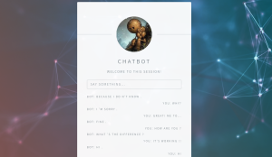

# Seq2Seq ChatBot: Chat with Joey!

## Introduction

Chat with Joey is a TensorFlow implementation of [A Neural Conversational Model](http://arxiv.org/abs/1506.05869) (aka the Google chatbot) with the help of [DeepQA repo](https://github.com/Conchylicultor/DeepQA). It make use of a [seq2seq model RNN](https://www.tensorflow.org/tutorials/seq2seq) for sentence predictions. The chatbot is designed to mimic the personality of Joey, a character from the tv-show friends(more about this under dataset). 


#### Table of Contents

* [Installation](#installation)
* [Running](#running)
* [Dataset](#dataset)
* [Hyperparameters)(#hyperparameter)
* [Results](#results)
* [Improvements](#improvements)
* [Credits](#credits)

## Installation

To run the project you will need:
 * python 3.5
 * tensorflow (v0.12)
 * django (1.10)
 * channels
 * Redis
 * asgi_redis (at least 1.0)
 *[CKPT FILE](

## Running

Once you installed all the dependencies 

### Chatbot

To train the model, simply run `main.py`. Once trained, you can test the results with `main.py --test` (results generated in 'save/model/samples_predictions.txt') or `main.py --test interactive` (more fun).

Here are some flags which could be useful. For more help and options, use `python main.py -h`:
 * `--modelTag <name>`: allow to give a name to the current model to differentiate between them when testing/training.
 * `--keepAll`: use this flag when training if when testing, you want to see the predictions at different steps (it can be interesting to see the program changes its name and age as the training progress). Warning: It can quickly take a lot of storage space if you don't increase the `--saveEvery` option.
 * `--verbose`: when testing, will print the sentences as they are computed.
 * `--playDataset`: show some dialogue samples from the dataset (can be use conjointly with `--createDataset` if this is the only action you want to perform).

To visualize the computational graph and the cost with [TensorBoard](https://www.tensorflow.org/how_tos/summaries_and_tensorboard/), just run `tensorboard --logdir save/`.

By default, the network architecture is a standard encoder/decoder with two LSTM layers (hidden size of 256) and an embedding size for the vocabulary of 32. The network is trained using ADAM. The maximum sentence length is set to 10 words, but can be increased.

### Web interface

Once trained, it's possible to chat with it using a more user friendly interface. The server will look at the model present on `save/model-server/model.ckpt`. The first time you want to use it, you'll need to configure it with:

```bash
export CHATBOT_SECRET_KEY="my-secret-key"
cd chatbot_website/
python manage.py makemigrations
python manage.py migrate
```

Then, to launch the server locally, use the following commands:

```bash
cd chatbot_website/
redis-server &  # Launch Redis in background
python manage.py runserver
```

After launch, the interface should be available on [http://localhost:8000/](http://localhost:8000/). If you want to deploy the program on a server, use `python manage.py runserver 0.0.0.0` instead. More info [here](https://docs.djangoproject.com/en/1.10/howto/deployment/checklist/).

[](http://e-pot.xyz/cv/chatbot.png)

## Results


## Improvements


